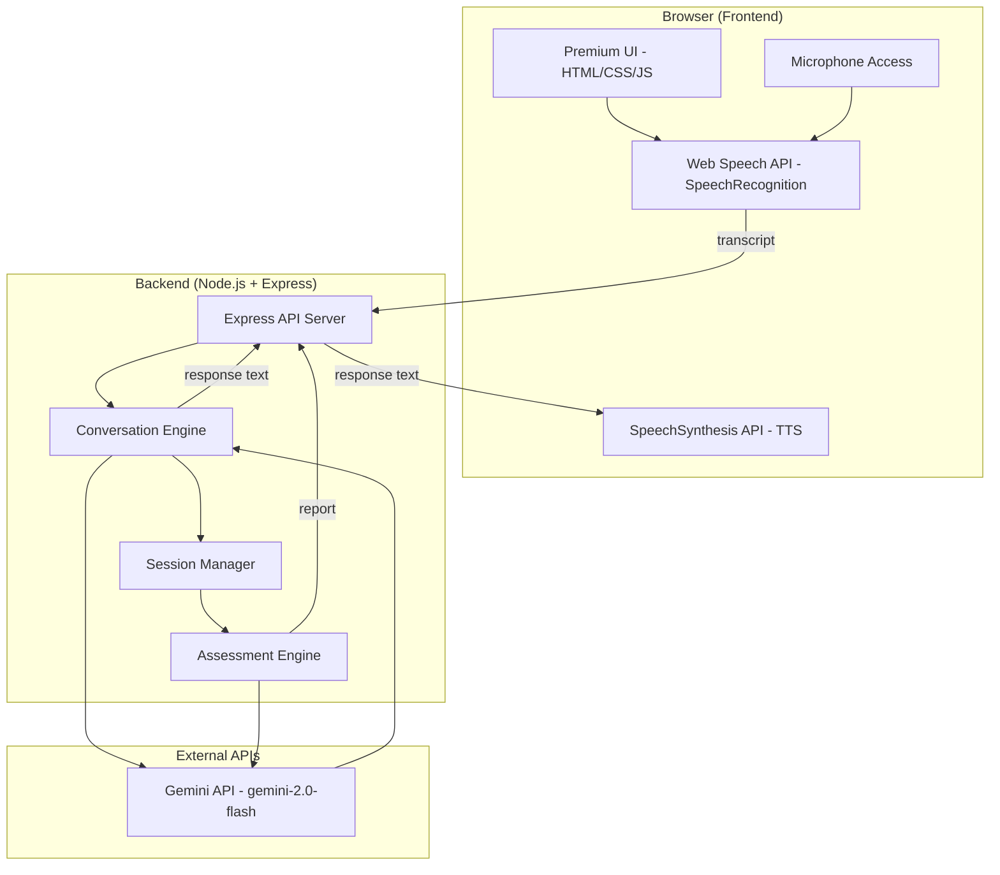

# Cuemath AI Tutor Screener — Implementation Plan

## Overview

Build a browser-based AI interviewer that conducts a ~10-minute voice conversation with tutor candidates, assessing their soft skills (communication clarity, patience, warmth, ability to simplify, English fluency) and producing a structured evaluation report with per-dimension scores and evidence quotes.

## Architecture



### Technology Stack

| Layer | Technology | Rationale |
|-------|-----------|-----------|
| **Frontend** | Vanilla HTML + CSS + JS | Lightweight, no framework overhead, premium design |
| **Speech-to-Text** | Browser Web Speech API | Zero cost, no API keys for STT, works in Chrome/Edge |
| **Text-to-Speech** | Browser SpeechSynthesis API | Natural voices, zero latency, no external dependency |
| **Backend** | Node.js + Express | Simple server for API key security & conversation logic |
| **AI Engine** | Google Gemini API (`gemini-2.0-flash`) | Fast, high-quality reasoning, affordable, great at conversation |
| **Session Storage** | In-memory (Map) | Sufficient for screening tool; no DB needed for MVP |

> [!IMPORTANT]
> **API Key Required**: The user will need a Google Gemini API key (free tier available at [aistudio.google.com](https://aistudio.google.com)). The key is stored server-side only — never exposed to the browser.

---

## Proposed Changes

### 1. Project Scaffolding

#### [NEW] `package.json`
- Node.js project with Express, @google/genai SDK, dotenv, uuid dependencies
- Dev script using nodemon for hot reload

#### [NEW] `.env.example`
- Template for `GEMINI_API_KEY`

#### [NEW] `.gitignore`
- Standard Node.js ignores + `.env`

---

### 2. Backend — Conversation Engine

#### [NEW] `server.js`
- Express server serving static frontend + API routes
- **POST `/api/start-session`** — Creates a new interview session, returns session ID + opening AI greeting
- **POST `/api/message`** — Receives candidate transcript, sends to Gemini with full conversation history + system prompt, returns AI response
- **POST `/api/end-session`** — Triggers assessment generation, returns structured evaluation report
- **GET `/api/session/:id/report`** — Retrieves the final assessment report

#### [NEW] `conversation-engine.js`
- Manages Gemini API interaction with a carefully crafted **system prompt** that instructs the AI to:
  - Act as "Maya," a warm, professional Cuemath interview coordinator
  - Ask scenario-based questions that reveal tutoring ability
  - Follow up on vague or one-word answers naturally
  - Adapt questioning based on candidate responses
  - Keep conversations flowing, not robotic
  - Gracefully handle tangents by steering back
- Maintains full conversation history per session
- Question bank (embedded in system prompt):
  1. *"Can you tell me a little about yourself and why you're interested in tutoring with Cuemath?"* (warmth, motivation)
  2. *"How would you explain fractions to a 9-year-old who's never heard of them?"* (simplification, clarity)
  3. *"A student has been staring at a problem for 5 minutes and says 'I just don't get it.' What do you do?"* (patience, empathy)
  4. *"Can you walk me through how you'd make an online math session fun and engaging?"* (creativity, energy)
  5. *"Tell me about a time you had to explain something complex to someone — how did you approach it?"* (communication, adaptability)

#### [NEW] `assessment-engine.js`
- After conversation ends, sends full transcript to Gemini with an **assessment prompt**
- Produces structured JSON report:
  ```json
  {
    "overallScore": 82,
    "recommendation": "ADVANCE",
    "dimensions": {
      "communicationClarity": { "score": 85, "evidence": ["quote1", "quote2"], "notes": "..." },
      "warmthAndEmpathy": { "score": 78, "evidence": [...], "notes": "..." },
      "abilityToSimplify": { "score": 90, "evidence": [...], "notes": "..." },
      "patienceAndAdaptability": { "score": 80, "evidence": [...], "notes": "..." },
      "englishFluency": { "score": 75, "evidence": [...], "notes": "..." }
    },
    "summary": "Overall narrative summary...",
    "strengths": ["...", "..."],
    "areasForImprovement": ["...", "..."]
  }
  ```
- Scoring rubric (0-100):
  - **90-100**: Exceptional — immediate advance
  - **70-89**: Good — advance to next round
  - **50-69**: Borderline — review recommended
  - **Below 50**: Not recommended at this time

#### [NEW] `session-manager.js`
- In-memory session store (Map)
- Each session tracked: `{ id, status, startTime, conversationHistory, report }`
- Auto-cleanup after 1 hour

---

### 3. Frontend — Premium Voice Interview UI

The UI has **3 distinct phases**, each a full-screen view with smooth transitions:

#### Phase 1: Welcome / Landing Screen
- Cuemath branding (orange/teal palette)
- Professional welcome message explaining the process
- Microphone permission check
- Browser compatibility check (Web Speech API)
- "Begin Interview" CTA button
- Estimated duration: ~10 minutes

#### Phase 2: Interview / Conversation Screen
- **Central voice visualizer** — animated waveform/pulse that reacts to speech state
- **Live transcript panel** — shows current conversation in a chat-like format
- **Status indicators**: "Maya is listening...", "Maya is thinking...", "Your turn to speak..."
- **Timer** — shows elapsed time
- **Push-to-talk OR auto-detect** mode toggle
- **End Interview** button (with confirmation)
- Subtle ambient gradient background animation

#### Phase 3: Assessment / Report Screen
- **Overall score** with circular progress indicator
- **Dimension breakdown** — 5 radar chart or bar chart visualization
- **Per-dimension cards** with score, evidence quotes, and notes
- **Strengths & Areas for Improvement** sections
- **Recommendation badge** (Advance / Review / Not Recommended)
- Option to download report as PDF (via print CSS)

#### [NEW] `public/index.html`
- Single-page app with all three phases
- SEO meta tags, favicon, Google Fonts (Inter)

#### [NEW] `public/styles.css`
- Complete design system:
  - Cuemath-inspired palette: `#FF6B35` (orange), `#1B998B` (teal), dark mode backgrounds
  - Glassmorphism cards, gradient borders
  - Smooth page transitions (CSS animations)
  - Voice visualizer animation (CSS + JS canvas)
  - Responsive design (mobile-friendly for candidates on phones)
  - Premium typography with Inter font

#### [NEW] `public/app.js`
- Main application controller (phase management, state machine)
- Voice interaction manager:
  - `SpeechRecognition` setup with interim results
  - `SpeechSynthesis` for AI responses with natural voice selection
  - Auto-silence detection (pause → send transcript)
  - Microphone volume visualization
- API communication layer
- Transcript renderer
- Timer management
- Error handling & recovery (mic failures, API timeouts, browser issues)

#### [NEW] `public/report.js`
- Assessment report renderer
- Score visualization (circular progress, dimension bars)
- Evidence quote highlighting
- Print/PDF export support

---

## Edge Cases Handled

| Edge Case | Solution |
|-----------|----------|
| **One-word answers** | AI system prompt instructs follow-up: "Could you tell me a bit more about that?" |
| **Long tangents** | AI gently steers back: "That's interesting! Let me bring us back to..." |
| **Choppy audio / recognition errors** | Retry mechanism + "I didn't catch that clearly, could you repeat?" |
| **Browser doesn't support Speech API** | Graceful fallback message with browser recommendation |
| **Microphone permission denied** | Clear instructions with visual guide |
| **Candidate goes silent >30s** | AI prompts: "Take your time — I'm still here whenever you're ready" |
| **Network disconnection** | Session preserved, reconnection support |
| **Very short interviews (<2 min)** | Assessment notes insufficient data, flags for manual review |

---

## Open Questions

> [!IMPORTANT]
> **1. Gemini API Key**: Do you already have a Google Gemini API key, or should I include setup instructions? The free tier provides 15 RPM which is sufficient for this use case.

> [!IMPORTANT] 
> **2. Branding Assets**: Should I use Cuemath's actual logo/colors (~orange `#FF6B35`), or would you prefer a neutral design that you can customize later?

> [!NOTE]
> **3. Interview Duration**: The plan targets ~5-7 questions over ~10 minutes. Should the interview be shorter or longer?

---

## Verification Plan

### Automated Tests
- Start the dev server and verify all API endpoints return correct responses
- Test the full interview flow in-browser (landing → interview → report)

### Browser Testing
- Use the browser tool to walk through the complete candidate journey
- Verify voice recognition and synthesis work correctly
- Test edge cases (short answers, silence, browser compatibility warnings)
- Validate the assessment report rendering with all dimensions

### Manual Verification
- Complete a full mock interview to validate conversation quality
- Review generated assessment report for accuracy and fairness
