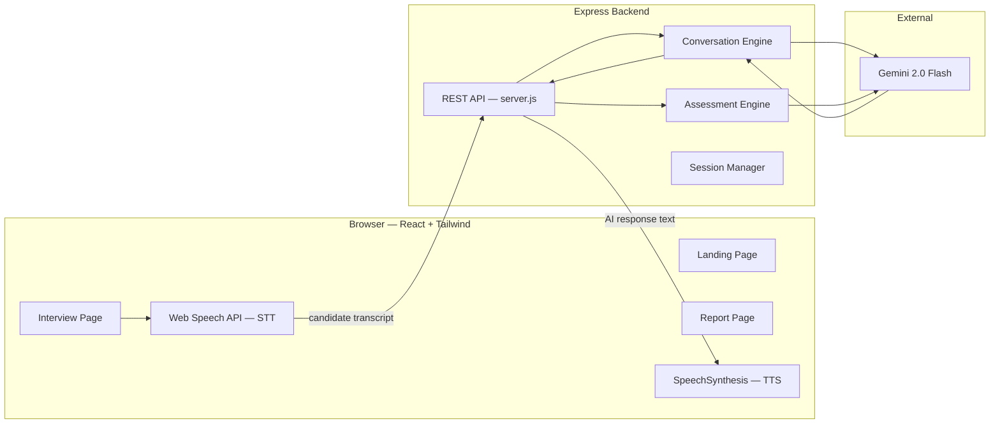

# Cuemath AI Tutor Screener — Project Overview & Walkthrough

## What Is This Project?

The **Cuemath AI Tutor Screener** is a browser-based, AI-powered voice interviewer that screens tutor candidates for [Cuemath](https://www.cuemath.com) — an online math tutoring platform for children aged 6-16. It conducts a **~10-minute natural voice conversation** with candidates and produces a **structured, evidence-based assessment report** evaluating their soft skills.

> [!NOTE]
> This is **not** a math knowledge test. It evaluates tutoring soft skills: communication, warmth, ability to simplify, patience, and English fluency.

---

## Architecture



| Layer | Technology | Why |
|-------|-----------|-----|
| **Frontend** | React + Vite + Tailwind CSS | Fast dev, responsive, premium design |
| **Speech-to-Text** | Browser Web Speech API | Zero cost, no extra API keys, works in Chrome/Edge |
| **Text-to-Speech** | Browser `SpeechSynthesis` | Natural voices, zero latency |
| **Backend** | Node.js + Express | Lightweight API server, keeps Gemini key server-side |
| **AI Engine** | Google Gemini 2.0 Flash | Fast, affordable, excellent at conversational AI |
| **Session Store** | In-memory `Map` | Good enough for MVP — no database needed |

---

## Project Structure

```
d:\Cuemath\
├── server.js                  # Express API server (4 REST endpoints)
├── conversation-engine.js     # Gemini-powered AI interviewer "Maya"
├── assessment-engine.js       # Post-interview evaluation generator
├── session-manager.js         # In-memory session store with auto-cleanup
├── package.json               # Root package — runs both servers
├── .env                       # GEMINI_API_KEY (not committed)
├── .env.example               # Template for environment variables
├── .gitignore
│
└── client/                    # React + Tailwind frontend
    ├── index.html
    ├── vite.config.js         # Vite config with API proxy → :3000
    ├── tailwind.config.js     # Cuemath brand design tokens
    ├── postcss.config.js
    ├── package.json
    └── src/
        ├── main.jsx           # React entry point
        ├── App.jsx            # Phase state machine (landing → interview → report)
        ├── index.css          # Tailwind directives + custom utilities
        └── components/
            ├── LandingPhase.jsx     # Welcome screen + browser/mic checks
            ├── InterviewPhase.jsx   # Voice interview + live transcript + audio visualizer
            ├── ReportPhase.jsx      # Assessment visualization with scores & evidence
            ├── GradientOrbs.jsx     # Animated floating background orbs
            └── Icons.jsx            # SVG icon components
```

---

## Backend Walkthrough

### 1. [server.js](file:///d:/Cuemath/server.js) — The API Layer

The Express server exposes **4 API endpoints** that the React frontend calls:

| Endpoint | Method | Purpose |
|----------|--------|---------|
| `/api/start-session` | POST | Creates a new session, starts Gemini chat, returns greeting |
| `/api/message` | POST | Sends candidate's speech transcript to Gemini, returns AI response |
| `/api/end-session` | POST | Ends the interview and generates an assessment report |
| `/api/session/:id/report` | GET | Retrieves a previously generated report |

**Key logic in `/api/message`:** After 7+ question exchanges or 12+ minutes, the server injects a system note telling Maya to start wrapping up the interview naturally.

### 2. [conversation-engine.js](file:///d:/Cuemath/conversation-engine.js) — The AI Interviewer "Maya"

This is the core AI brain. It uses a detailed **system prompt** to instruct Gemini to act as "Maya," a warm, professional Cuemath interviewer. Key behaviors:

- **Persona**: Warm, friendly, professional — not robotic
- **Structure**: 5-7 scenario-based questions over ~10 minutes
- **Probing**: If a candidate gives a vague answer, Maya follows up: *"Could you tell me a bit more about that?"*
- **Refocusing**: If a candidate goes on a tangent, Maya steers back gently
- **Question bank** includes scenarios like:
  - *"How would you explain fractions to a 9-year-old?"*
  - *"A student says 'I just don't get it.' What do you do?"*
  - *"How would you handle a child who keeps getting distracted?"*

### 3. [assessment-engine.js](file:///d:/Cuemath/assessment-engine.js) — The Evaluator

After the interview ends, the full transcript is sent to Gemini with a **structured assessment prompt**. It produces a JSON report evaluating the candidate across **5 dimensions** (0-100):

1. **Communication Clarity** — Can they explain things clearly?
2. **Warmth & Empathy** — Are they approachable and kind?
3. **Ability to Simplify** — Can they break down concepts for kids?
4. **Patience & Adaptability** — How do they handle confusion?
5. **English Fluency** — Natural, fluent communication?

Each dimension includes a score, direct evidence quotes, and notes. The report also provides:
- **Overall score** (weighted average — communication and simplification weighted higher)
- **Recommendation**: `ADVANCE` / `REVIEW` / `NOT_RECOMMENDED`
- **Strengths** and **Areas for Improvement**

Has a **fallback assessment** in case Gemini fails, flagging for manual review.

### 4. [session-manager.js](file:///d:/Cuemath/session-manager.js) — Session Store

An in-memory `Map`-based session store that tracks:
- Session ID (UUID v4), status (`active` → `completed`), timestamps
- Full conversation history with timestamps
- Question count
- Final assessment report

Includes **auto-cleanup** — stale sessions are purged every 30 minutes (sessions older than 1 hour).

---

## Frontend Walkthrough

The app is a **3-phase state machine** managed by [App.jsx](file:///d:/Cuemath/client/src/App.jsx):

```
Landing → Interview → Report
```

### Phase 1: [LandingPhase.jsx](file:///d:/Cuemath/client/src/components/LandingPhase.jsx) — Welcome Screen

- Cuemath-branded dark mode UI with glassmorphism cards
- Animated gradient orbs in the background ([GradientOrbs.jsx](file:///d:/Cuemath/client/src/components/GradientOrbs.jsx))
- **Browser compatibility check** — verifies Web Speech API support
- **Microphone permission check** — requests mic access and confirms it works
- Displays interview expectations (duration, what to expect)
- "Begin Interview" CTA → calls `/api/start-session` → transitions to Phase 2

### Phase 2: [InterviewPhase.jsx](file:///d:/Cuemath/client/src/components/InterviewPhase.jsx) — Voice Interview

The largest component (~19KB). Handles:

- **Voice Input**: Browser `SpeechRecognition` API with auto-silence detection
- **Voice Output**: Browser `SpeechSynthesis` plays Maya's responses aloud
- **Audio Visualizer**: Canvas-based animated ring that responds to microphone volume
- **Live Transcript**: Chat-style log showing both the candidate and Maya's messages
- **Timer**: Shows elapsed interview time
- **Status Indicators**: "Maya is listening…", "Maya is thinking…", "Your turn to speak…"
- **End Interview** button with confirmation dialog → calls `/api/end-session`

### Phase 3: [ReportPhase.jsx](file:///d:/Cuemath/client/src/components/ReportPhase.jsx) — Assessment Report

- **Overall score** displayed with a circular progress indicator
- **Recommendation badge** (Advance / Review / Not Recommended) with color coding
- **Per-dimension cards** showing score bars, evidence quotes, and assessment notes
- **Strengths & Areas for Improvement** sections
- **CSS print styles** for downloading/printing the report as PDF

### Supporting Components

| Component | Purpose |
|-----------|---------|
| [GradientOrbs.jsx](file:///d:/Cuemath/client/src/components/GradientOrbs.jsx) | Animated floating gradient blobs in the background |
| [Icons.jsx](file:///d:/Cuemath/client/src/components/Icons.jsx) | Reusable SVG icon components used across phases |

---

## How to Run

```bash
# 1. Set your Gemini API key
#    Copy .env.example → .env and add your key from aistudio.google.com

# 2. Install dependencies (also installs client deps via postinstall)
cd d:\Cuemath
npm install

# 3. Start both servers concurrently
npm run dev
```

This launches:
- **Express backend** on `http://localhost:3000` (API + Gemini integration)
- **Vite dev server** on `http://localhost:5173` (React frontend, proxies API calls to :3000)

Open `http://localhost:5173` in **Chrome or Edge** (required for Web Speech API).

---

## Key Design Decisions

| Decision | Rationale |
|----------|-----------|
| **Web Speech API** instead of a paid STT service | Zero cost, no extra API keys, good enough for screening |
| **In-memory sessions** instead of a database | MVP simplicity — no setup overhead, sessions are short-lived |
| **Gemini 2.0 Flash** instead of other models | Fast response times crucial for voice conversation flow |
| **React + Tailwind** instead of vanilla HTML | Component reuse, responsive design, rapid iteration |
| **Server-side Gemini calls** | API key never exposed to the browser |
| **Weighted scoring** | Communication & Simplification matter most for tutoring |

---

## Validation Status

- ✅ Landing page renders with Cuemath branding, dark mode, glassmorphism
- ✅ Browser & microphone compatibility checks functional
- ✅ Backend API endpoints tested (start-session, message, end-session)
- ✅ Responsive layout across mobile, tablet, and desktop
- ✅ Assessment engine produces structured JSON with fallback handling
- ⬜ Full end-to-end voice interview flow (requires real microphone in browser)
